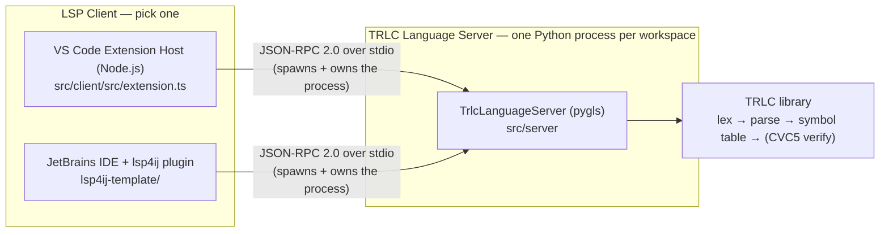
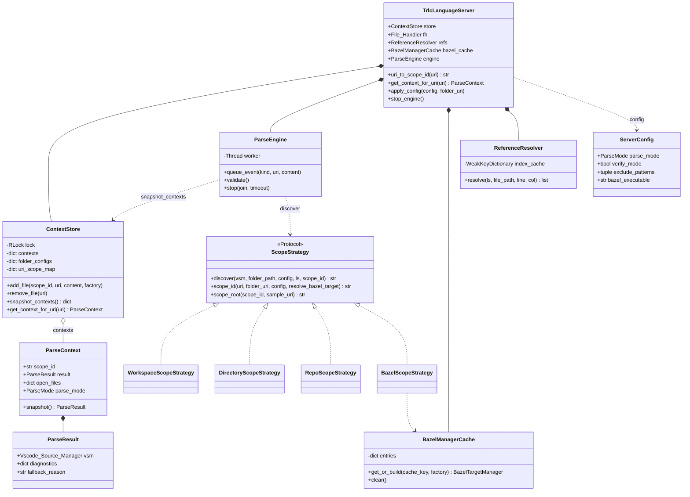
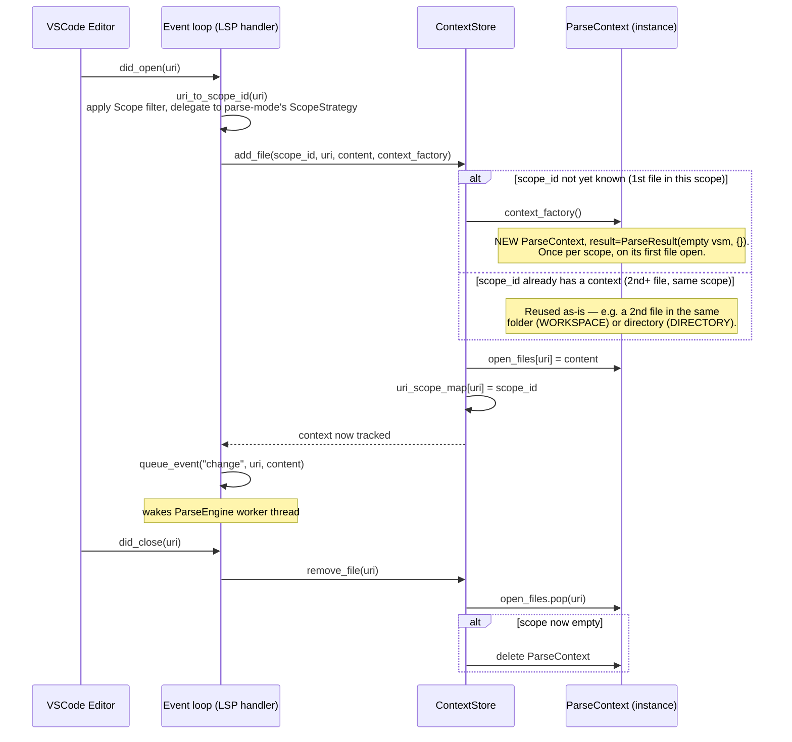
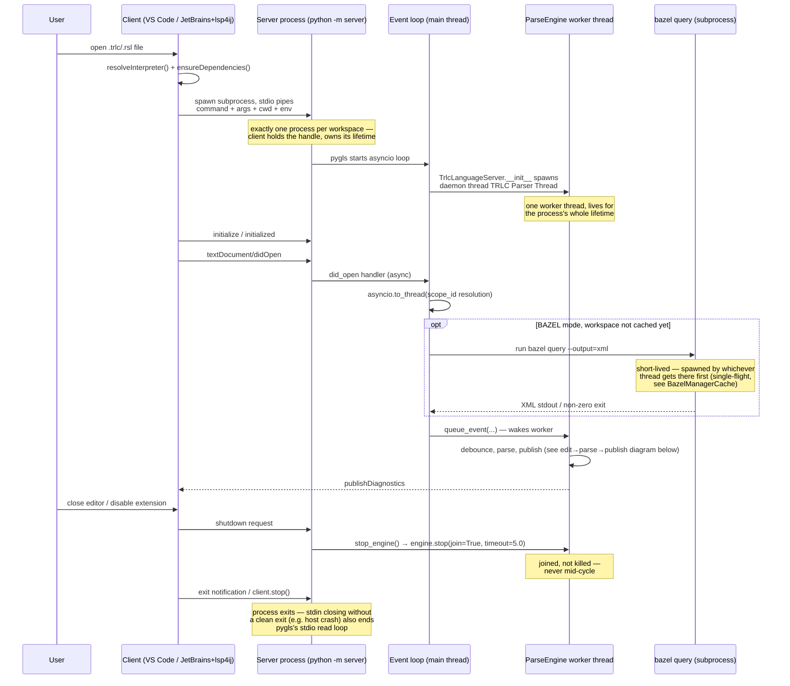
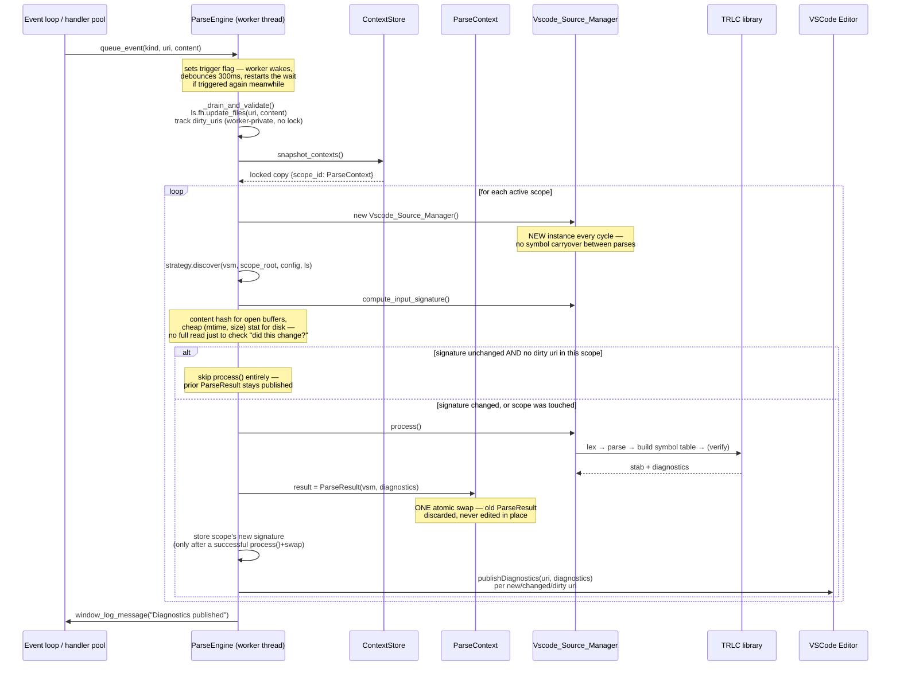
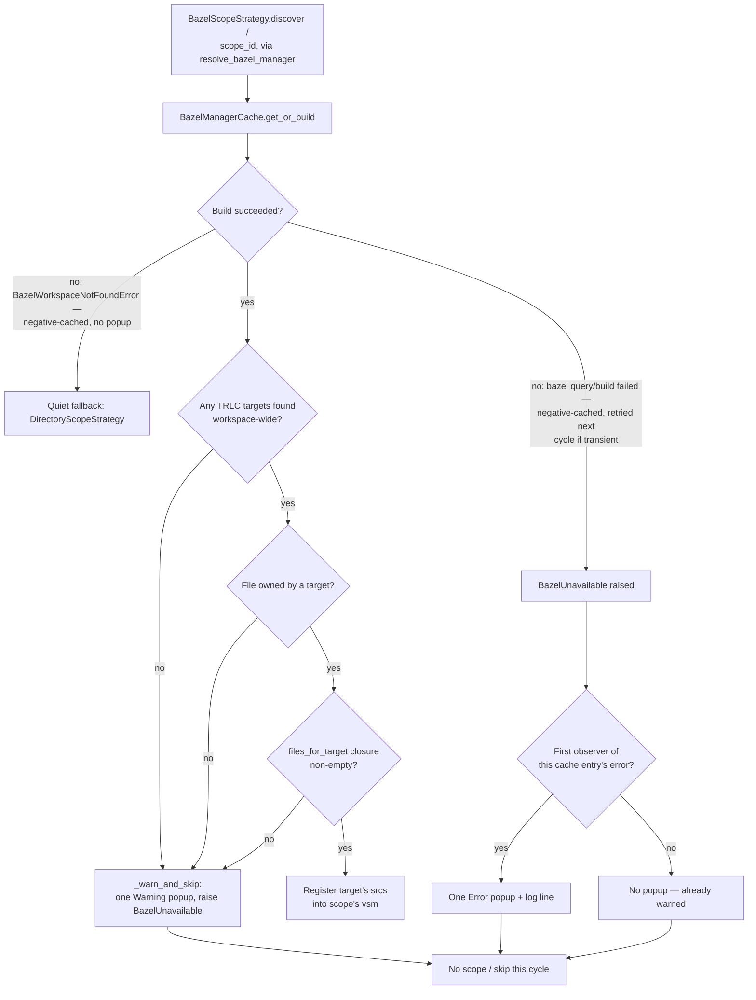

# Architecture

**Audience: Developer.** Assumes familiarity with the codebase; describes
internal structure, not usage. For day-to-day usage see
[USER_GUIDE.md](USER_GUIDE.md); for build/test/debug workflows see
[DEVELOPER_GUIDE.md](DEVELOPER_GUIDE.md); for building on top of this extension
see [CORPORATE_INTEGRATION.md](CORPORATE_INTEGRATION.md).

---

## System Overview

Two independent OS processes, one wire protocol between them:

- **Client** — either the VS Code extension host (`src/client`, Node.js,
  `vscode-languageclient`) or a JetBrains IDE running the **lsp4ij** plugin
  (config in [`lsp4ij-template/`](../lsp4ij-template/)). Owns editor UI,
  document sync, and the server process's lifecycle.
- **Server** — one Python process per workspace (`src/server`, pygls-based
  `TrlcLanguageServer`), entry point `python -m server` (`__main__.py`). Owns
  all TRLC semantics: parsing, symbol tables, diagnostics, completion, hover,
  navigation.

Both clients speak the same protocol to the same server binary — LSP
(JSON-RPC 2.0) over **stdio** by default (`trlc_server.start_io()`; TCP/WS
exist for manual debugging, see `__main__.py`). A client only needs to spawn
the process, speak LSP over its stdin/stdout, and render whatever the server
returns.



- The **client** owns the server subprocess: spawns it, sends `initialize`,
  and performs a clean `shutdown`/`exit` on deactivate (see
  [Concurrency § Process & thread ownership](#process--thread-ownership)).
- The **server** is stateless about editor chrome: it knows only documents,
  LSP capabilities, and `trlcServer.*` settings pushed to it. All
  TRLC-specific logic (scoping, parsing, diagnostics) lives server-side, so a
  new client needs to be LSP-correct, not TRLC-aware.

### Class diagram

One `TrlcLanguageServer` per process, holding the shared components every
handler and the parse worker read:



---

## Context Store

Each parse **scope** gets its own isolated `ParseContext`, holding a dedicated
`Vscode_Source_Manager` (and therefore its own symbol table). `ContextStore`
(`context_store.py`) owns every active scope's `ParseContext`, the per-folder
configuration overrides, and the `uri -> scope_id` map recording which scope
each open document belongs to.

### Why scopes exist

TRLC has no concept of "everything else in the repo I haven't loaded" — a
symbol clash is detected only within the set of files a single
`Vscode_Source_Manager` parses together. Two files with the same definition
name in different directories (`dir1/example.rsl`, `dir2/example.rsl`), parsed
into one shared symbol table, produce a false "duplicate definition"
diagnostic even though neither was meant to interact. Scope isolation keeps
unrelated parts of a workspace from colliding by coincidence of naming.

A scope also bounds each parse's input set: `parseMode` decides which files
enter a given scope's from-scratch parse (DIRECTORY parses a handful, REPO the
whole tree). A context makes each parse *smaller*, not *incremental*.

### Scope boundary by parse mode

| Mode | Scope | Boundary | Rationale |
|------|-------|----------|-----------|
| **WORKSPACE** | Per folder | All open files + transitive `.rsl` includes in one folder | Interactive editing; cross-file imports expected |
| **DIRECTORY** | Per directory | Single directory only; no recursion | Monorepo support; isolates same-named files in different dirs |
| **REPO** | Per folder | Full recursive walk of folder | Global rename/references; requires flat namespace |
| **BAZEL** | Per target | One Bazel target's `srcs`; quiet fallback to DIRECTORY only when the folder isn't a Bazel workspace at all (see [Bazel](#bazel)) | Monorepo with fine-grained targets |

Scope boundaries are hard: a symbol not found in a file's own scope is an
error, not a lookup into some merged table.

```python
@dataclass(frozen=True)
class ParseResult:
    vsm: Vscode_Source_Manager     # isolated symbol table
    diagnostics: Dict[str, Any]    # uri -> list[Diagnostic], this scope's last parse
    fallback_reason: Optional[str] = None  # BAZEL-only: this cycle fell back to
                                            # a different discovery strategy

@dataclass
class ParseContext:
    scope_id: str                  # unique per scope ("file:///folder" or "file:///folder::/dir")
    result: ParseResult            # published as ONE atomic reference swap, never mutated in place
    open_files: Dict[str, str]     # uri -> content, editor-open files in this scope
    parse_mode: ParseMode

    def snapshot(self) -> ParseResult:
        return self.result         # the ONLY way to read vsm/diagnostics/fallback_reason
```

`vsm` and `diagnostics` belong together — the symbol table and error list from
the *same* parse run, published as one frozen object so a reader never
observes a torn (mismatched) pair. See [Concurrency](#concurrency) for the
mechanism and the one handler rule.

Lifecycle:
- **Created** on `did_open` if not present for this scope.
- **Updated** on `did_change` (content) and by each parse cycle (`result` swap).
- **Destroyed** when the last open file in the scope closes.

`contexts`, `open_files`, and the `uri -> scope_id` map are owned by
`ContextStore`, never mutated on `ParseContext` directly:



### Scope ID format

`scope_id` is both a dict key in `ContextStore`'s `contexts` map and a string
that survives a round trip: built when a file opens
(`TrlcLanguageServer.uri_to_scope_id`), decoded later by the parse engine to
recover which folder/directory/target to scan. One shared format on both ends
keeps the two directions from drifting:

- **WORKSPACE/REPO**: `folder_uri` (e.g. `file:///home/user/project`)
- **DIRECTORY**: `folder_uri::directory_path` (e.g. `file:///project::/project/src/utils`)
- **BAZEL**: `folder_uri::target_label` (e.g. `file:///project::/pkg:trlc_spec`);
  DIRECTORY-shaped fallback format when the folder isn't a Bazel workspace at
  all (`BazelWorkspaceNotFoundError`); no scope_id when Bazel is genuinely
  unavailable (broken query/build) — see [Bazel](#bazel).

Built and parsed exclusively via `token_utils.encode_scope_id()` /
`decode_scope_id()` — no caller hand-rolls the `"::"` split.

### Implications

- A symbol not found in a file's own scope is a real error — no cross-scope
  fallback, by design.
- Renaming across a scope boundary only rewrites the scope under the cursor;
  REPO mode is required for a workspace-wide rename (see
  [Known Limitations](#known-limitations)).
- Read `result.vsm` and `result.diagnostics` via one `context.snapshot()`
  bound once per method — see [Concurrency](#concurrency).

---

## Concurrency

### Process & thread ownership

| What | Spawned by | When | Owns teardown |
|---|---|---|---|
| Server process (`python -m server`) | Client (VS Code `extension.ts` `startLangServer`, or JetBrains `lsp4ij`) | Extension activation / first matching file opened | Client — `shutdown` request + `exit` (`LanguageClient.stop()` in `deactivate()`) |
| asyncio event loop | pygls, inside the server process | Server start (`trlc_server.start_io()`) | Ends when the process exits |
| Handler-pool threads | pygls, inside the server process | Lazily, per concurrent sync handler | pygls (process exit) |
| `ParseEngine` worker (`"TRLC Parser Thread"`, daemon) | `TrlcLanguageServer.__init__` — one per process | Server start | Server — `stop_engine()` on `shutdown` joins it (`engine.stop(join=True, timeout=5.0)`) |
| `bazel query` subprocess | Whichever thread first calls `resolve_bazel_manager` for a not-yet-cached workspace | Lazily, first BAZEL-mode scope resolution per workspace | Synchronous `subprocess.run(...)` — the calling thread reaps it directly; single-flighted (see [Bazel](#bazel)) |

The client owns exactly one OS process (the server); the server owns exactly
one extra long-lived thread (the parse worker) plus pygls's transient
handler-pool threads; the only other process is a short-lived `bazel query`,
read synchronously by its caller and never tracked as separate state.



### Participants and rules

Three participants touch shared server state:

- **Event loop** — async LSP handlers (`did_open`,
  `on_workspace_folders_change`, config changes — `handlers/lifecycle.py`).
- **Handler pool** — pygls runs *sync* feature handlers (`completion`,
  `hover`, `navigation`, `rename`, `status`, `did_change`, `did_close`) on a
  thread pool; event-loop handlers offload slow scope resolution onto it via
  `asyncio.to_thread(...)`. The request side is a *pool of threads*, not one.
- **Parse worker** — the single `ParseEngine` thread
  (`_run` → `_drain_and_validate` → `validate` → `_validate_scope`) that
  debounces edits and runs the actual TRLC parse.

Two ownership rules cover all shared state:

1. **Worker-private state has no lock.** `_dirty_uris`, `_scope_signatures`,
   and each cycle's `Vscode_Source_Manager`/message handler are touched only
   by the parse worker — the absence of a lock *is* the documentation that
   nothing else may touch them. The only synchronized hand-off into the worker
   is its event queue (the mailbox).
2. **Everything else is either an immutable snapshot or one of a handful of
   single-purpose locks** — never a lock shared across unrelated data.

`ParseEngine.validate()` (and `_dirty_uris`/`_scope_signatures`) is
single-writer: it must run only on the worker thread. `LanguageServer`
deliberately has no `validate()` wrapper — a delegate reachable from the
handler pool would let a request thread race `_drain_and_validate`. To trigger
a parse from outside the worker, `queue_event(...)` and let the worker pick
it up.

**`ContextStore`** uses an `RLock` (not a plain `Lock`) because `did_open`
needs two nested steps under one hold: read which config applies to a URI,
then — if this is the first file in the scope — *create* the `ParseContext`.
Lock holds are always plain dict operations; parsing happens outside the lock:

```python
contexts = ls.store.snapshot_contexts()   # locked copy
for scope_id, context in contexts.items():
    ...                                    # parse — no lock held
```

`snapshot_contexts()` copies only the mapping (`dict(self._contexts)`), not
the `ParseContext` objects — those stay the same live objects. That is safe
because each `ParseContext`'s mutable parts are protected differently:
`open_files` is only touched through `ContextStore`'s locked methods
(including the status-bar count read, `ContextStore.open_file_count`), and
`result` is only ever *replaced*, never edited in place.

**`ParseResult`** (`parse_context.py`) is how a scope's parse output crosses
threads, with no lock. The worker builds a complete new result off to the side
and does exactly one atomic reference swap:

```python
context.result = ParseResult(vsm=vsm, diagnostics=new_diagnostic_state)
```

A reader that captures `context.result` into a local **exactly once** always
sees one fully-consistent object — the swap can never be observed mid-flight
because nothing is half-written in place. `ParseContext` has no
`vsm`/`diagnostics`/`fallback_reason` shortcut properties, deliberately: a
property re-reading `self.result` on each access would invite a torn read.
`context.snapshot()` binds `self.result` once and returns the whole
`ParseResult`, so every field read off it comes from the same published
result.

### Edit → parse → publish (the actor cycle)



### Worker shutdown and lock ordering

`ParseEngine.stop(join=True, timeout=5.0)` signals the worker to exit, then
joins it (logging a warning if it doesn't exit within the timeout rather than
hanging). The `shutdown` handler (`handlers/lifecycle.py`) calls
`ls.stop_engine()` → `engine.stop()` before process exit, so the worker is
never killed mid-cycle (no half-published result or truncated publish). The
LSP `shutdown` request therefore completes only once any in-flight parse cycle
has finished (or 5s elapses).

`ContextStore`'s lock, `ParseEngine._queue_lock`, and `File_Handler`'s lock
are never held nested: the store lock is released before `queue_event` (which
takes `_queue_lock`), and `_drain_and_validate` releases `_queue_lock` before
`validate()` runs (which takes only the store lock, via
`snapshot_contexts()`).

### Implications

- **Handler rule:** capture `context.snapshot()` into a local exactly once per
  method, then read `.vsm`/`.diagnostics`/`.fallback_reason` off that local.
  Calling `snapshot()` twice in one method risks observing two parse
  generations.
- **Engine rule:** new per-cycle `ParseEngine` bookkeeping needs a lock only
  if something outside the worker touches it. Worker-private → leave unlocked;
  that absence is the invariant.
- A scope's parse can be skipped entirely (its previous `ParseResult` stays
  published) when nothing in it changed — see
  [Parse Flow](#parse-flow-file-discovery-to-diagnostics).

---

## Bazel

`BazelManagerCache` (`bazel.py`, `ls.bazel_cache`) holds, per Bazel workspace
root, the `BazelTargetManager` built from a single `bazel query`.
`BazelScopeStrategy` (`scope_strategies.py`) uses that cached manager both to
discover which files belong to a scope and to resolve which target a document
belongs to.

### Why the cache and single-flight

`bazel query` is a real subprocess that can take sub-second to tens of
seconds. Running it under a lock other LSP requests need would stall them for
the query's whole duration; running it once per parse cycle would repeat that
cost on every keystroke's debounce. So it runs at most once per workspace,
outside any lock, single-flighted.

A query can fail (bad executable, broken BUILD file), or succeed but find
nothing relevant to one file (no TRLC targets, no matching rule classes, file
in no target's `srcs`, a resolved target with no parse-relevant files). These
are distinct from "no `WORKSPACE`/`MODULE.bazel` here at all": they mean Bazel
*is* set up but something needs fixing. Each shows one clear popup and leaves
the scope alone (no context, or last-published diagnostics kept) — see
[Resolution outcomes](#resolution-outcomes).

A folder with no `WORKSPACE`/`MODULE.bazel` marker
(`BazelWorkspaceNotFoundError`) is deliberately *not* a workspace-level
failure, even though it subclasses `BazelUnavailable`: a multi-root or nested
setup can legitimately mix Bazel and non-Bazel folders. It is the sole
condition that gets a quiet `DirectoryScopeStrategy` fallback with no popup,
negative-cached until the workspace folders themselves change.

### Cache mechanics

`BazelManagerCache.get_or_build(cache_key, factory)` builds a manager at most
once per *cache_key*: the first caller runs *factory* (constructs a
`BazelTargetManager` and runs its one `build_targets()` — the `bazel query` +
XML parse) outside any lock; concurrent callers for the same key wait on the
in-flight build (a per-entry `Event`) instead of starting their own. A factory
failure — including `BazelWorkspaceNotFoundError` — is negative-cached and
re-raised to every subsequent caller until `clear()`, so a broken setup fails
fast. `clear()` drops all cached managers and runs on any `"reparse"` event
(config change, folder change, `extension.parseAll`), so a workspace edit — or
a fixed `bazel_executable` — can't serve stale data.

`BazelManagerCache.evict_retryable_errors()` runs once per parse cycle
(`ParseEngine.validate()`, before contexts are validated) and drops only
transient failures. `_is_bazel_error_retryable` classifies a `BazelQueryError`
as retryable when the subprocess produced no real exit code (`returncode is
None`: timeout, missing executable, OS error) or exited with Bazel's "server
lock held by another command" code (32). `BazelWorkspaceNotFoundError` and any
other returncode are structural and left alone. A cache key's "already warned"
state (`consume_error_for_warning`) is tracked separately from the entry so a
retried transient failure doesn't re-show the popup for a still-ongoing
problem; only `clear()` resets it.

This `Event`-based single-flight is the only place a manager's first build is
serialized — `BazelTargetManager.build_targets()` has no build-time lock; it
takes its `_lock` only briefly to read/write `_targets`/`_file_to_targets`.
That is sufficient because a manager instance is never reachable by a second
thread until `get_or_build` finished building it; the one other call site
(`BazelScopeStrategy.discover()`, worker thread only) always hits the
already-populated early-return in `build_targets()`.

`resolve_bazel_manager(ls, folder_path, config)` is the single entry point
both `BazelScopeStrategy.scope_id()` (via
`TrlcLanguageServer._resolve_bazel_target`) and `BazelScopeStrategy.discover()`
call. It resolves the workspace root, delegates to `get_or_build`, and — the
first time a cache_key's failure is observed (`consume_error_for_warning`) —
shows one `MessageType.Error` popup naming the reason, then re-raises
`BazelUnavailable` (or `BazelWorkspaceNotFoundError` / `BazelQueryError`).
When no workspace root is found, the cache key falls back to *folder_path*
itself, so that failure is single-flighted and negative-cached like any query
failure — not re-walked every parse cycle.

### Resolution outcomes



`did_open` resolves a BAZEL-mode document's scope
(`uri_to_scope_id` → `_resolve_bazel_target`) via
`await asyncio.to_thread(...)`, so the first resolution's underlying
`bazel query` runs off the event loop and other concurrent LSP requests stay
responsive. Other parse modes' scope resolution is pure in-memory computation
and returns immediately.

### Implications

- A workspace's `bazel query` result is shared by every scope resolution and
  parse-cycle discovery for that workspace — never repeated per file or cycle.
- Any Bazel failure or "query found nothing usable" shows one popup and leaves
  the scope alone until the next reparse (or, for transient query/build
  failures, the next cycle via `evict_retryable_errors`) — see the outcomes
  table above. Only a folder with no Bazel workspace at all degrades quietly to
  directory-mode parsing.

---

## Scope Strategies

Each `ParseMode` has a `ScopeStrategy` implementation
(`scope_strategies.py`) with three operations:

```python
class ScopeStrategy(Protocol):
    def discover(self, vsm, folder_path, config, ls, scope_id="") -> Optional[str]:
        """Register files with vsm per the discovery strategy.
        Returns a human-readable reason if this cycle fell back to a different
        strategy than configured (BAZEL only), else None — published onto
        ParseResult.fallback_reason."""

    def scope_id(self, uri, folder_uri, config, resolve_bazel_target) -> Optional[str]:
        """Return the scope_id uri belongs to under this mode."""

    def scope_root(self, scope_id, sample_uri) -> str:
        """Return the directory/folder/target discovery should run from.
        Every mode but BAZEL derives this from scope_id's own segment; BAZEL's
        segment is a target label, not a path, so it uses sample_uri's dir."""
```

`TrlcLanguageServer.uri_to_scope_id()` resolves the owning workspace folder and
applies the `Trlc Server: Scope` filter (via `select_scope()`), then delegates
the mode-specific scope math to the strategy's `scope_id()`. The parse
engine's `_build_vsm()` computes `scope_root()`, then delegates file discovery
to the same strategy's `discover()`. A new `ParseMode` is one new strategy
class plus one entry in the `_STRATEGIES` registry — no scope-id branching
scattered elsewhere.

- **WorkspaceScopeStrategy** registers the scope's open files (filtered to
  files under this folder, since `ls.fh` is one global open-files map shared
  across every folder's scope) plus marks the folder as an include search
  path. `.rsl` files under that path become *eligible* for transitive
  inclusion; `vsm.process()`'s `build_graph()` then determines, from the open
  files' `import` statements, which eligible files are actually reachable —
  only those get fully parsed.
- **DirectoryScopeStrategy** registers only files in one directory
  (non-recursive), via `os.listdir()`. Each file's content is editor buffer
  first, disk otherwise (`_read_file()`), so an open-but-unsaved file is parsed
  with its unsaved content.
- **RepoScopeStrategy** registers all `.rsl`/`.trlc` files via
  `vsm.register_workspace(folder_path)` (recursive walk, excludes `bazel-*`),
  which checks the open-files map per file before falling back to disk.
- **BazelScopeStrategy** — see [Bazel](#bazel).

---

## ServerConfig

Immutable configuration (`server_config.py`), constructed from VSCode settings
(`trlcServer.*`), per-folder overrides (`extension.selectScopeFolder`), and the
legacy `parsing: "partial"/"full"` mapping:

```python
@dataclass(frozen=True)
class ServerConfig:
    parse_mode: ParseMode = ParseMode.WORKSPACE
    verify_mode: bool = True
    exclude_patterns: Tuple[str, ...] = ()
    invalid_patterns: Tuple[str, ...] = ()   # excludePatterns entries that failed re.compile
    scope: str = ""
    bazel_executable: str = "bazel"
    bazel_rule_classes: Tuple[str, ...] = field(default_factory=...)
    invalid_rule_classes: Tuple[str, ...] = ()   # ruleClasses entries that aren't valid Starlark identifiers
    bazel_use_shared_server: bool = False
```

Frozen and tuple-typed so an in-flight config reference is safe to hand to the
parse worker mid-cycle without a defensive copy — nothing can mutate it out
from under a reader. `from_dict()` validates each `excludePatterns` entry with
`re.compile`; entries that fail are dropped from `exclude_patterns` and
collected into `invalid_patterns`, which `handlers/lifecycle.py` surfaces as
one warning naming the bad patterns. `bazel.ruleClasses` entries get the same
treatment: each is validated against a Starlark-identifier pattern (they are
interpolated unescaped into a `kind()` query — see [Bazel](#bazel)), and
anything failing is dropped into `invalid_rule_classes` and warned the same
way.

## ServerProtocol

`server_protocol.py` defines the structural type every handler function and
`ParseEngine` accept as `ls`, instead of the concrete `TrlcLanguageServer`:
`store: ContextStore`, `workspace: WorkspaceProtocol` (the `folders` dict +
`get_text_document()` subset handlers use), plus the methods handlers call.
`TrlcLanguageServer` satisfies it structurally; unit tests substitute a
lightweight `FakeLanguageServer` dataclass — no live pygls server required.

## ReferenceResolver

`ReferenceResolver` (`reference_resolver.py`, `ls.refs`) answers
find-references and rename queries by scanning every `IDENTIFIER` token in the
scope's `Vscode_Source_Manager` once and caching the entity-to-locations index
in a `weakref.WeakKeyDictionary` keyed by the vsm instance. Since the parse
engine replaces (never mutates) the vsm on every real reparse, a new parse
generation's vsm starts with no cached index, and an old vsm's cache entry is
freed once nothing but the cache references it — the resolver never
accumulates indexes for every parse generation a session has seen.

## folder_for_uri

`token_utils.folder_for_uri()` resolves which workspace folder a document URI
belongs to by decoding both the document and each candidate folder URI to real
filesystem paths (percent-decoding, Windows drive-letter normalization via
`pygls.uris.to_fs_path`), then matching only when the document path equals a
folder's path or is nested under it (a path-separator boundary) — never a bare
string prefix, which would treat `/home/foo-bar` as contained within
`/home/foo`.

---

## Language Server Architecture

`TrlcLanguageServer` subclasses `pygls.lsp.server.LanguageServer` and holds:

| Attribute | Type | Purpose |
|-----------|------|---------|
| `store` | `ContextStore` | Thread-safe: active parse scopes, per-folder config overrides, uri→scope_id map |
| `config` | `ServerConfig` (property) | `store.default_config` — a property for call-site compatibility |
| `fh` | `File_Handler` | In-memory URI → content map |
| `refs` | `ReferenceResolver` | Cross-file find-references, shared by navigation and rename |
| `bazel_cache` | `BazelManagerCache` | Per-workspace `BazelTargetManager` cache — see [Bazel](#bazel) |
| `engine` | `ParseEngine` | Background worker thread |

`uri_to_scope_id()` (parse-mode-dependent scope math) stays on
`TrlcLanguageServer` rather than `ContextStore`, since it needs
`self.workspace.folders` and isn't itself shared mutable state —
`ContextStore` is pure data storage. It resolves the owning workspace folder
via `folder_for_uri()`, then delegates the mode-specific scope math to that
mode's `ScopeStrategy.scope_id()`. A uri outside every workspace folder
resolves to `None` — no context, no parsing.

---

## Parse Flow: File Discovery to Diagnostics

One parse cycle:

```
0. Strategy.scope_root(scope_id, sample_uri)
   └─ where directory/folder/target discovery runs from — decoded from
      scope_id's own segment for every mode but BAZEL, which uses sample_uri's
      directory (its segment is a target label, not a path)

1. Strategy.discover(vsm, scope_root, config, ls, scope_id)
   ├─ register_file(uri, content)     ← open editor buffer preferred over disk
   │                                    in every mode (_read_file() for
   │                                    DIRECTORY/BAZEL, ls.fh directly for
   │                                    WORKSPACE, register_workspace() for REPO)
   ├─ register_include(folder_path)   ← mark folder as search path
   ├─ register_workspace(folder_path) ← recursive walk (REPO only)
   └─ returns fallback_reason         ← non-None only when BAZEL fell back to a
                                         different strategy this cycle; raising
                                         BazelUnavailable instead skips this
                                         scope's cycle entirely (step 4 never runs)

1b. vsm.compute_input_signature()
   └─ if unchanged since this scope's last successful parse, AND no dirty uri
      belongs to this scope → skip step 2; the previous ParseResult stays
      published and nothing is republished this cycle

2. vsm.process()  ← Vscode_Source_Manager (subclass of trlc.trlc.Source_Manager)
   ├─ TRLC lexer: tokenize registered files (content from File_Handler, not disk)
   ├─ TRLC parser: build AST (resolves imports across registered files)
   ├─ TRLC symbol table builder: vsm.stab = SymbolTable with all definitions
   └─ TRLC type checker (if verify_mode): CVC5 formal verification of constraints

3. message_handler.py (Vscode_Message_Handler)
   └─ Convert TRLC errors → LSP Diagnostics (line, character, severity, message)

4. parse_engine._validate_scope()
   ├─ context.result = ParseResult(vsm, diagnostics)  ← ONE atomic swap
   ├─ Compute diagnostic diff against the previous context.snapshot().diagnostics
   │  (clear URIs that disappeared; republish URIs whose diagnostics changed or
   │   that were just edited)
   └─ Publish per-scope: ls.text_document_publish_diagnostics(...)
```

### Key design points

**Fresh symbol table per cycle — but not always a fresh parse:** each
`_validate_scope()` creates a new `Vscode_Source_Manager` and always re-runs
discovery — no symbol carryover, ever. `validate()` loops over every open scope
each cycle, not just the edited file's; what is skipped per scope is the actual
`process()` (lex/parse/symbol-table/CVC5) when `compute_input_signature()`
matches the last successful parse and nothing in the scope was edited (see the
[actor-cycle figure](#edit--parse--publish-the-actor-cycle)). A keystroke in
folder A triggers a cheap discovery pass over B/C/D but not a full re-parse —
"parse cheaply, skip expensively", not true incremental parsing (see
[Future Enhancements](#future-enhancements)).

**File content from editor, not disk:** every strategy prefers the in-memory
`File_Handler` (open buffers) over disk for any open file — unsaved edits are
reflected immediately in all four modes. A file open but never saved (no file
on disk) is only visible in WORKSPACE mode, since DIRECTORY/BAZEL/REPO
discovery walks/queries what already exists on disk.

**Scope-local discovery:** each strategy receives exactly one scope root
(directory/folder/target), not the whole workspace, so
`DirectoryScopeStrategy`'s `os.listdir()` avoids cross-directory pollution.

**Per-scope diagnostics:** each scope has independent diagnostic state. Same
filename in different directories = separate diagnostic streams.

### Syntax highlighting (client-side, no server)

Not used for parsing:
- `trlc-grammar.json` — TextMate grammar (regex-based)
- `trlc-language-configuration.json` — brackets, comments, auto-close

Registered in `package.json` (`contributes.grammars`, `contributes.languages`)
for instant syntax highlighting. The TRLC library does **semantic** parsing on
the server, independent of the grammar.

---

## LSP Features

| Feature | Handler | Notes |
|---------|---------|-------|
| `textDocument/didOpen` | `lifecycle.py` | Resolves scope_id (off the event loop via `asyncio.to_thread`); creates context; queues parse |
| `textDocument/didChange` | `lifecycle.py` | Queues per-scope reparse |
| `textDocument/didClose` | `lifecycle.py` | Removes file; destroys context if empty |
| `workspace/didChangeConfiguration` | `lifecycle.py` | Reloads settings; triggers full reparse |
| `workspace/didChangeWorkspaceFolders` | `lifecycle.py` | Invalidates all contexts; queues reparse |
| `shutdown` | `lifecycle.py` | Stops the parse worker (joined, not killed) — see [Concurrency](#concurrency) |
| `textDocument/completion` | `completion.py` | Uses `context.snapshot().vsm.stab` for symbol lookup |
| `textDocument/hover` | `hover.py` | Fetches symbol from context; returns `description` |
| `textDocument/typeDefinition` | `navigation.py` | Jumps to entity declaration |
| `textDocument/references` | `navigation.py` | Scope-local reference lookup, via `ReferenceResolver` |
| `textDocument/rename` | `rename.py` | Scope-local rename (REPO mode for global), via `ReferenceResolver` |
| `textDocument/semanticTokens/full` | `semantic_tokens.py` | Reuses cached token stream |
| `textDocument/codeAction` | `code_actions.py` | Quick fixes for TRLC diagnostics |
| `trlc/scopeStatus` | `status.py` | Custom request: scope up-to-date status for the status bar |
| `trlc/scopeFiles` | `status.py` | Custom request: files in the active file's scope |
| `extension.parseAll` command | `lifecycle.py` | Forces full reparse of all contexts |

Key handler pattern:
```python
context = ls.get_context_for_uri(uri)
if not context:
    return None  # or [] — not in any active scope
symbols = context.snapshot().vsm.stab  # scope-local symbol table
```

---

## Known Limitations

1. **Cross-scope imports are errors** — no import resolution across scope
   boundaries. By design; matches `parseMode` documentation.
2. **Rename is scope-local** — in DIRECTORY/BAZEL mode, renaming a symbol only
   affects files in that scope. REPO mode is required for a global rename.
3. **No workspace-folder restriction setting** — every open workspace folder
   is always parsed. Use `directory`, `repo`, or `bazel` parse mode to control
   the boundary within each folder (see [Scope Strategies](#scope-strategies)).

## Future Enhancements

- Hardening: BUILD-file invalidation triggers a reparse.
- Performance: true incremental parsing. The per-scope content-signature skip
  covers the common case cheaply but can only skip a scope's parse wholesale
  when nothing in it changed — it can't parse *part* of a changed scope. A real
  per-file incremental parse needs upstream changes to TRLC itself.

### TRLC incremental-parse track (co-developed, `trlc` is in-workspace)

`trlc` is a sibling working-dir repo (`bmw-software-engineering/trlc`), so this
is a concrete co-development track — edit the library, bump the local
dependency. Gated behind real need (today's signature-skip may be enough).
Each sub-track is independently shippable with its own tests and
`lobster-trace`/LRM annotation updates.

**Why "cache the AST and merge it in" doesn't work:** TRLC's
`Source_Manager.create_parser` binds every file's `Parser` to one global
`self.stab` at construction, and `trlc.ast.Symbol_Table.register()` is
append-only (no remove/evict). An AST built against an old symbol table can't
be spliced into a fresh one. The only viable path is a long-lived symbol table
reused across cycles, plus a way to withdraw a changed file's symbols before
re-parsing it.

Three sub-tracks, most independent first:

- **Per-object check/verify memo.** For `verify=true`, CVC5 verification
  (`Source_Manager.perform_checks` → each `Record_Object.perform_checks`)
  usually dominates parse time, and an AST cache wouldn't touch it. Cache
  `{object_id: (dep_hash, ok)}` on the `Source_Manager`; `dep_hash` covers the
  object's own resolved field values plus every object/type its checks
  reference (discoverable via `resolve_references`). Skip re-verifying an
  object whose `dep_hash` is unchanged. Purely additive — safe to ship alone
  and first.
- **Symbol table eviction (prerequisite for the next item).** Every `Entity`
  already carries `location.file_name`. Add
  `Symbol_Table.withdraw_file(file_name)` dropping every entry whose entity
  originated there (recursing into each `Package`'s symbol table, cleaning
  `imported` lists, pruning empty packages). The real risk is
  dependency-aware eviction: withdrawing file X can dangle references in file Y
  that imported it, so eviction must drop X **and** re-parse every file that
  transitively depends on it — reusing `Source_Manager.dep_graph` (already
  built by `build_graph()`) for that closure. This closure logic is the bulk
  of the work and the main correctness hazard; every current symbol-table
  caller assumes monotonic addition, so this is invasive.
- **Per-file lex+parse memo (depends on eviction).** Keep each file's `Parser`
  alive across `process()` calls, keyed by a content hash; skip
  re-lexing/re-parsing unchanged files, reusing their registered symbols in the
  persisted table. Changed files get evicted + reparsed with their dependents.
  Worthless without eviction — reusing a stab without removing stale symbols
  produces duplicate-definition errors.

**On the extension side**, once this lands upstream: replace the "fresh
`Vscode_Source_Manager` per cycle" rule with one long-lived VSM per scope, fed
edits and evictions instead of rebuilt from scratch. This needs a coordinated
`trlc>=X` bump across `pyproject.toml`, `src/server/BUILD.bazel`'s `py_wheel`
`requires`, and `requirements_dev.txt` (hand-synced today — see
RELEASE_AND_DEPLOYMENT.md).

---

## References

- [Language Server Protocol (LSP)](https://microsoft.github.io/language-server-protocol/)
- [Pygls Documentation](https://pygls.readthedocs.io/)
- [TRLC Language](https://github.com/bmw-software-engineering/trlc)
- [VSCode Extension API](https://code.visualstudio.com/api/references/vscode-api)
